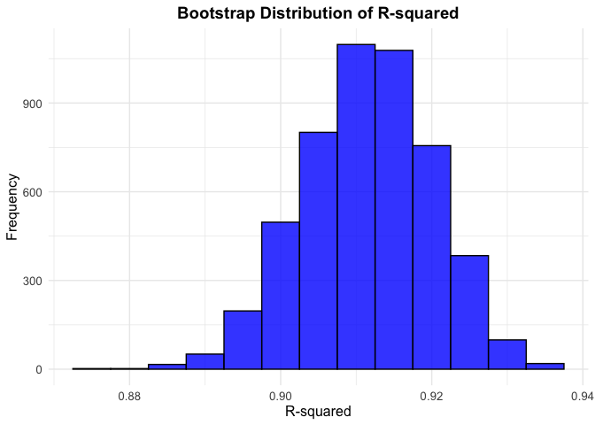
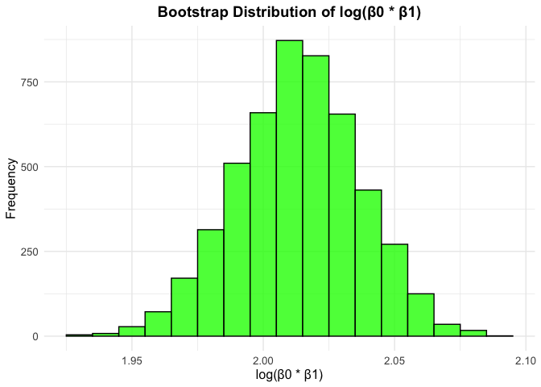
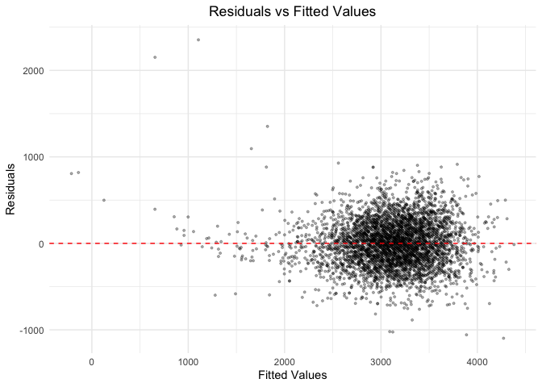
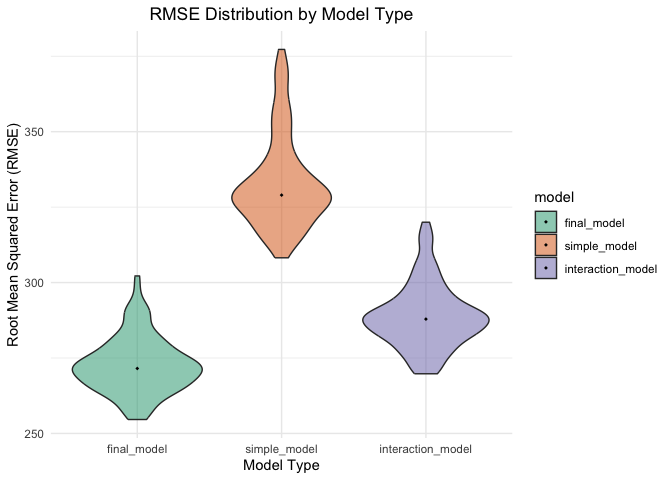

p8105_hw6_tc3326
================
KK Chen
2024-12-02

``` r
library(tidyverse)
```

    ## ── Attaching core tidyverse packages ──────────────────────── tidyverse 2.0.0 ──
    ## ✔ dplyr     1.1.4     ✔ readr     2.1.5
    ## ✔ forcats   1.0.0     ✔ stringr   1.5.1
    ## ✔ ggplot2   3.5.1     ✔ tibble    3.2.1
    ## ✔ lubridate 1.9.3     ✔ tidyr     1.3.1
    ## ✔ purrr     1.0.2     
    ## ── Conflicts ────────────────────────────────────────── tidyverse_conflicts() ──
    ## ✖ dplyr::filter() masks stats::filter()
    ## ✖ dplyr::lag()    masks stats::lag()
    ## ℹ Use the conflicted package (<http://conflicted.r-lib.org/>) to force all conflicts to become errors

``` r
library(modelr)
library(broom)
```

    ## 
    ## Attaching package: 'broom'
    ## 
    ## The following object is masked from 'package:modelr':
    ## 
    ##     bootstrap

## Problem 1

download data

``` r
weather_df = 
  rnoaa::meteo_pull_monitors(
    c("USW00094728"),
    var = c("PRCP", "TMIN", "TMAX"), 
    date_min = "2017-01-01",
    date_max = "2017-12-31") %>%
  mutate(
    name = recode(id, USW00094728 = "CentralPark_NY"),
    tmin = tmin / 10,
    tmax = tmax / 10) %>%
  select(name, id, everything())
```

    ## using cached file: /Users/chentianrong/Library/Caches/org.R-project.R/R/rnoaa/noaa_ghcnd/USW00094728.dly

    ## date created (size, mb): 2024-12-02 21:05:40.479075 (8.667)

    ## file min/max dates: 1869-01-01 / 2024-11-30

``` r
# Use 5000 bootstrap samples
bootstraps <- 
  weather_df %>%
  modelr::bootstrap(5000) %>%
  mutate(
    bootstrap_data = map(strap, as_tibble),
    fitted_models = map(bootstrap_data, ~ lm(tmax ~ tmin, data = .x))
  )

# Compute estimates for R-squared, β0, and β1
weather_results <- 
  bootstraps %>%
  mutate(coefficients = map(fitted_models, broom::tidy)) %>%
  unnest(coefficients) %>%
  select(bootstrap_id = .id, fitted_models, term, estimate) %>%
  pivot_wider(
    id_cols = c(bootstrap_id, fitted_models),
    names_from = term,
    values_from = estimate
  ) %>%
  select(bootstrap_id, 
         fitted_models, 
         intercept = `(Intercept)`, 
         slope = tmin) %>%
  mutate(
    log_intercept_slope = log(intercept * slope)
  ) %>%
  mutate(model_summary = map(fitted_models, broom::glance)) %>%
  unnest(model_summary) %>%
  select(bootstrap_id, intercept, slope, log_intercept_slope, r_squared = r.squared)

# Plot for R-squared
plot_r_squared <- weather_results %>%
  ggplot(aes(x = r_squared)) +
  geom_histogram(binwidth = 0.01, fill = "blue", color = "black", alpha = 0.8) +
  labs(
    title = "Bootstrap Distribution of R-squared",
    x = "R-squared",
    y = "Frequency"
  ) +
  theme_minimal() +
  theme(
    plot.title = element_text(hjust = 0.5, size = 14, face = "bold"),
    axis.title = element_text(size = 12),
    axis.text = element_text(size = 10)
  )

plot_r_squared
```

<!-- -->

``` r
# Plot for log(β0 * β1)
plot_log_beta <- weather_results %>%
  ggplot(aes(x = log_intercept_slope)) +
  geom_histogram(binwidth = 0.01, fill = "green", color = "black", alpha = 0.8) +
  labs(
    title = "Bootstrap Distribution of log(β0 * β1)",
    x = "log(β0 * β1)",
    y = "Frequency"
  ) +
  theme_minimal() +
  theme(
    plot.title = element_text(hjust = 0.5, size = 14, face = "bold"),
    axis.title = element_text(size = 12),
    axis.text = element_text(size = 10)
  )

plot_log_beta
```

<!-- --> \*
The R-squared values are concentrated around 0.91, with most values
between 0.89 and 0.93. The log(β₀ \* β₁) centered around 2.01, with most
values between 1.96 and 2.05. Both distributions are symmetric and
stable, indicating the robustness of the linear regression model.

95% confidence interval for R-squared and log(β0 \* β1)

``` r
ci_r_squared <- quantile(weather_results$r_squared, probs = c(0.025, 0.975))
ci_log_intercept_slope <- quantile(weather_results$log_intercept_slope, probs = c(0.025, 0.975))

tibble(
  Metric = c("R-squared", "log(β0 * β1)"),
  `2.5%` = c(ci_r_squared[1], ci_log_intercept_slope[1]),
  `97.5%` = c(ci_r_squared[2], ci_log_intercept_slope[2])
)
```

    ## # A tibble: 2 × 3
    ##   Metric       `2.5%` `97.5%`
    ##   <chr>         <dbl>   <dbl>
    ## 1 R-squared     0.894   0.927
    ## 2 log(β0 * β1)  1.97    2.06

## Problem 2

Import and Read the data

``` r
homicides = read_csv("./data/homicide-data.csv", na = c(".", "", "NA"))
```

    ## Rows: 52179 Columns: 12
    ## ── Column specification ────────────────────────────────────────────────────────
    ## Delimiter: ","
    ## chr (9): uid, victim_last, victim_first, victim_race, victim_age, victim_sex...
    ## dbl (3): reported_date, lat, lon
    ## 
    ## ℹ Use `spec()` to retrieve the full column specification for this data.
    ## ℹ Specify the column types or set `show_col_types = FALSE` to quiet this message.

Data processing

``` r
homicides_clean <- homicides %>%
  mutate(
    city_state = paste(city, state, sep = ", "),
    solved_binary = ifelse(disposition %in% c("Closed without arrest", "Open/No arrest"), 0, 1)
  ) %>%
  filter(
    !(city_state %in% c("Dallas, TX", "Phoenix, AZ", "Kansas City, MO", "Tulsa, AL")),
    victim_race %in% c("White", "Black")
  ) %>%
  mutate(victim_age = as.numeric(victim_age)) %>%
  drop_na(victim_age)
```

    ## Warning: There was 1 warning in `mutate()`.
    ## ℹ In argument: `victim_age = as.numeric(victim_age)`.
    ## Caused by warning:
    ## ! NAs introduced by coercion

Logistic Regression for Baltimore

``` r
baltimore_model <- homicides_clean %>%
  filter(city_state == "Baltimore, MD") %>%
  glm(solved_binary ~ victim_age + victim_sex + victim_race, data = ., family = binomial)

baltimore_results <- broom::tidy(baltimore_model) %>%
  mutate(odds_ratio = exp(estimate))

baltimore_ci <- exp(confint(baltimore_model))
```

    ## Waiting for profiling to be done...

``` r
baltimore_or <- baltimore_results %>%
  filter(term == "victim_sexMale") %>%
  summarize(
    odds_ratio = odds_ratio,
    ci_lower = baltimore_ci["victim_sexMale", 1],
    ci_upper = baltimore_ci["victim_sexMale", 2]
  )

baltimore_or
```

    ## # A tibble: 1 × 3
    ##   odds_ratio ci_lower ci_upper
    ##        <dbl>    <dbl>    <dbl>
    ## 1      0.426    0.324    0.558

Logistic Regression for All Cities

``` r
city_model_results <- homicides_clean %>%
  group_by(city_state) %>%
  nest() %>%
  mutate(
    city_model = map(data, ~ glm(solved_binary ~ victim_age + victim_sex + victim_race, data = ., family = binomial)),
    city_or_ci = map(city_model, function(model) {
      model_tidy <- broom::tidy(model) %>%
        mutate(odds_ratio = exp(estimate))
      ci <- exp(confint(model))
      sex_ci <- ci["victim_sexMale", ]
      model_tidy %>%
        filter(term == "victim_sexMale") %>%
        summarize(
          odds_ratio = odds_ratio,
          ci_lower = sex_ci[1],
          ci_upper = sex_ci[2]
        )
    })
  ) %>%
  select(city_state, city_or_ci) %>%
  unnest(city_or_ci)
```

    ## Waiting for profiling to be done...
    ## Waiting for profiling to be done...
    ## Waiting for profiling to be done...
    ## Waiting for profiling to be done...
    ## Waiting for profiling to be done...
    ## Waiting for profiling to be done...
    ## Waiting for profiling to be done...
    ## Waiting for profiling to be done...
    ## Waiting for profiling to be done...
    ## Waiting for profiling to be done...
    ## Waiting for profiling to be done...
    ## Waiting for profiling to be done...
    ## Waiting for profiling to be done...
    ## Waiting for profiling to be done...
    ## Waiting for profiling to be done...
    ## Waiting for profiling to be done...
    ## Waiting for profiling to be done...
    ## Waiting for profiling to be done...
    ## Waiting for profiling to be done...
    ## Waiting for profiling to be done...
    ## Waiting for profiling to be done...
    ## Waiting for profiling to be done...
    ## Waiting for profiling to be done...
    ## Waiting for profiling to be done...
    ## Waiting for profiling to be done...
    ## Waiting for profiling to be done...
    ## Waiting for profiling to be done...
    ## Waiting for profiling to be done...
    ## Waiting for profiling to be done...
    ## Waiting for profiling to be done...
    ## Waiting for profiling to be done...
    ## Waiting for profiling to be done...
    ## Waiting for profiling to be done...
    ## Waiting for profiling to be done...
    ## Waiting for profiling to be done...
    ## Waiting for profiling to be done...
    ## Waiting for profiling to be done...
    ## Waiting for profiling to be done...
    ## Waiting for profiling to be done...
    ## Waiting for profiling to be done...
    ## Waiting for profiling to be done...
    ## Waiting for profiling to be done...
    ## Waiting for profiling to be done...
    ## Waiting for profiling to be done...
    ## Waiting for profiling to be done...
    ## Waiting for profiling to be done...
    ## Waiting for profiling to be done...

    ## Warning: There were 44 warnings in `mutate()`.
    ## The first warning was:
    ## ℹ In argument: `city_or_ci = map(...)`.
    ## ℹ In group 1: `city_state = "Albuquerque, NM"`.
    ## Caused by warning:
    ## ! glm.fit: fitted probabilities numerically 0 or 1 occurred
    ## ℹ Run `dplyr::last_dplyr_warnings()` to see the 43 remaining warnings.

``` r
city_model_results %>%
  knitr::kable(
    digits = 3,
    format = "markdown"
  )
```

| city_state         | odds_ratio | ci_lower | ci_upper |
|:-------------------|-----------:|---------:|---------:|
| Albuquerque, NM    |      1.767 |    0.825 |    3.762 |
| Atlanta, GA        |      1.000 |    0.680 |    1.458 |
| Baltimore, MD      |      0.426 |    0.324 |    0.558 |
| Baton Rouge, LA    |      0.381 |    0.204 |    0.684 |
| Birmingham, AL     |      0.870 |    0.571 |    1.314 |
| Boston, MA         |      0.674 |    0.353 |    1.277 |
| Buffalo, NY        |      0.521 |    0.288 |    0.936 |
| Charlotte, NC      |      0.884 |    0.551 |    1.391 |
| Chicago, IL        |      0.410 |    0.336 |    0.501 |
| Cincinnati, OH     |      0.400 |    0.231 |    0.667 |
| Columbus, OH       |      0.532 |    0.377 |    0.748 |
| Denver, CO         |      0.479 |    0.233 |    0.962 |
| Detroit, MI        |      0.582 |    0.462 |    0.734 |
| Durham, NC         |      0.812 |    0.382 |    1.658 |
| Fort Worth, TX     |      0.669 |    0.394 |    1.121 |
| Fresno, CA         |      1.335 |    0.567 |    3.048 |
| Houston, TX        |      0.711 |    0.557 |    0.906 |
| Indianapolis, IN   |      0.919 |    0.678 |    1.241 |
| Jacksonville, FL   |      0.720 |    0.536 |    0.965 |
| Las Vegas, NV      |      0.837 |    0.606 |    1.151 |
| Long Beach, CA     |      0.410 |    0.143 |    1.024 |
| Los Angeles, CA    |      0.662 |    0.457 |    0.954 |
| Louisville, KY     |      0.491 |    0.301 |    0.784 |
| Memphis, TN        |      0.723 |    0.526 |    0.984 |
| Miami, FL          |      0.515 |    0.304 |    0.873 |
| Milwaukee, wI      |      0.727 |    0.495 |    1.054 |
| Minneapolis, MN    |      0.947 |    0.476 |    1.881 |
| Nashville, TN      |      1.034 |    0.681 |    1.556 |
| New Orleans, LA    |      0.585 |    0.422 |    0.812 |
| New York, NY       |      0.262 |    0.133 |    0.485 |
| Oakland, CA        |      0.563 |    0.364 |    0.867 |
| Oklahoma City, OK  |      0.974 |    0.623 |    1.520 |
| Omaha, NE          |      0.382 |    0.199 |    0.711 |
| Philadelphia, PA   |      0.496 |    0.376 |    0.650 |
| Pittsburgh, PA     |      0.431 |    0.263 |    0.696 |
| Richmond, VA       |      1.006 |    0.483 |    1.994 |
| San Antonio, TX    |      0.705 |    0.393 |    1.238 |
| Sacramento, CA     |      0.669 |    0.326 |    1.314 |
| Savannah, GA       |      0.867 |    0.419 |    1.780 |
| San Bernardino, CA |      0.500 |    0.166 |    1.462 |
| San Diego, CA      |      0.413 |    0.191 |    0.830 |
| San Francisco, CA  |      0.608 |    0.312 |    1.155 |
| St. Louis, MO      |      0.703 |    0.530 |    0.932 |
| Stockton, CA       |      1.352 |    0.626 |    2.994 |
| Tampa, FL          |      0.808 |    0.340 |    1.860 |
| Tulsa, OK          |      0.976 |    0.609 |    1.544 |
| Washington, DC     |      0.690 |    0.465 |    1.012 |

Plot of ORs and CIs by City

``` r
city_model_results %>%
  ggplot(aes(x = reorder(city_state, odds_ratio), y = odds_ratio)) +
  geom_point(size = 3) +
  geom_errorbar(aes(ymin = ci_lower, ymax = ci_upper), width = 0.2) +
  coord_flip() +
  geom_hline(yintercept = 1, linetype = "dashed", color = "red") +
  labs(
    title = "Estimated Odds Ratios and Confidence Intervals by City",
    caption = "Adjusted Odds Ratios for Solving Homicides (Male vs Female Victims)",
    x = "City",
    y = "Adjusted Odds Ratio (95% CI)"
  ) +
  theme_minimal() +
  theme(
    axis.text.y = element_text(size = 10),
    axis.title = element_text(size = 12),
    plot.title = element_text(hjust = 0.5, size = 14)
  )
```

<!-- -->

- In six cities: Albuquerque, Stockton, Fresno, Nashville, Richmond, and
  Atlanta, male victims are more likely to have cases solved. In most
  cities, male victims are less likely to have their cases solved
  compared to female victims.

## Problem 3

Import and Clean data

``` r
birthweight_data <- read_csv("./data/birthweight.csv", na = c(".", "", "NA")) %>%
  mutate(
    baby_sex = factor(babysex, levels = c(1, 2), labels = c("Male", "Female")),
    father_race = factor(frace, levels = c(1, 2, 3, 4, 8, 9), labels = c("White", "Black", "Asian", "Puerto Rican", "Other", "Unknown")),
    mother_race = factor(mrace, levels = c(1, 2, 3, 4, 8), labels = c("White", "Black", "Asian", "Puerto Rican", "Other")),
    malformations = factor(malform, levels = c(0, 1), labels = c("Absent", "Present"))
  )
```

    ## Rows: 4342 Columns: 20
    ## ── Column specification ────────────────────────────────────────────────────────
    ## Delimiter: ","
    ## dbl (20): babysex, bhead, blength, bwt, delwt, fincome, frace, gaweeks, malf...
    ## 
    ## ℹ Use `spec()` to retrieve the full column specification for this data.
    ## ℹ Specify the column types or set `show_col_types = FALSE` to quiet this message.

Stepwise regression to propose a model

``` r
full_model <- lm(bwt ~ ., data = birthweight_data)
stepwise_model <- step(full_model, direction = "both")
```

    ## Start:  AIC=48717.83
    ## bwt ~ babysex + bhead + blength + delwt + fincome + frace + gaweeks + 
    ##     malform + menarche + mheight + momage + mrace + parity + 
    ##     pnumlbw + pnumsga + ppbmi + ppwt + smoken + wtgain + baby_sex + 
    ##     father_race + mother_race + malformations
    ## 
    ## 
    ## Step:  AIC=48717.83
    ## bwt ~ babysex + bhead + blength + delwt + fincome + frace + gaweeks + 
    ##     malform + menarche + mheight + momage + mrace + parity + 
    ##     pnumlbw + pnumsga + ppbmi + ppwt + smoken + wtgain + baby_sex + 
    ##     father_race + mother_race
    ## 
    ## 
    ## Step:  AIC=48717.83
    ## bwt ~ babysex + bhead + blength + delwt + fincome + frace + gaweeks + 
    ##     malform + menarche + mheight + momage + mrace + parity + 
    ##     pnumlbw + pnumsga + ppbmi + ppwt + smoken + wtgain + father_race + 
    ##     mother_race
    ## 
    ## 
    ## Step:  AIC=48717.83
    ## bwt ~ babysex + bhead + blength + delwt + fincome + frace + gaweeks + 
    ##     malform + menarche + mheight + momage + mrace + parity + 
    ##     pnumlbw + pnumsga + ppbmi + ppwt + smoken + father_race + 
    ##     mother_race
    ## 
    ## 
    ## Step:  AIC=48717.83
    ## bwt ~ babysex + bhead + blength + delwt + fincome + frace + gaweeks + 
    ##     malform + menarche + mheight + momage + mrace + parity + 
    ##     pnumlbw + ppbmi + ppwt + smoken + father_race + mother_race
    ## 
    ## 
    ## Step:  AIC=48717.83
    ## bwt ~ babysex + bhead + blength + delwt + fincome + frace + gaweeks + 
    ##     malform + menarche + mheight + momage + mrace + parity + 
    ##     ppbmi + ppwt + smoken + father_race + mother_race
    ## 
    ## 
    ## Step:  AIC=48717.83
    ## bwt ~ babysex + bhead + blength + delwt + fincome + frace + gaweeks + 
    ##     malform + menarche + mheight + momage + parity + ppbmi + 
    ##     ppwt + smoken + father_race + mother_race
    ## 
    ## 
    ## Step:  AIC=48717.83
    ## bwt ~ babysex + bhead + blength + delwt + fincome + gaweeks + 
    ##     malform + menarche + mheight + momage + parity + ppbmi + 
    ##     ppwt + smoken + father_race + mother_race
    ## 
    ##               Df Sum of Sq       RSS   AIC
    ## - father_race  4    124365 320848704 48712
    ## - malform      1      1419 320725757 48716
    ## - ppbmi        1      6346 320730684 48716
    ## - momage       1     28661 320752999 48716
    ## - mheight      1     66886 320791224 48717
    ## - menarche     1    111679 320836018 48717
    ## - ppwt         1    131132 320855470 48718
    ## <none>                     320724338 48718
    ## - fincome      1    193454 320917792 48718
    ## - parity       1    413584 321137922 48721
    ## - mother_race  3    868321 321592659 48724
    ## - babysex      1    853796 321578134 48727
    ## - gaweeks      1   4611823 325336161 48778
    ## - smoken       1   5076393 325800732 48784
    ## - delwt        1   8008891 328733230 48823
    ## - blength      1 102050296 422774634 49915
    ## - bhead        1 106535716 427260054 49961
    ## 
    ## Step:  AIC=48711.51
    ## bwt ~ babysex + bhead + blength + delwt + fincome + gaweeks + 
    ##     malform + menarche + mheight + momage + parity + ppbmi + 
    ##     ppwt + smoken + mother_race
    ## 
    ##               Df Sum of Sq       RSS   AIC
    ## - malform      1      1447 320850151 48710
    ## - ppbmi        1      6975 320855679 48710
    ## - momage       1     28379 320877083 48710
    ## - mheight      1     69502 320918206 48710
    ## - menarche     1    115708 320964411 48711
    ## - ppwt         1    133961 320982665 48711
    ## <none>                     320848704 48712
    ## - fincome      1    194405 321043108 48712
    ## + frace        1     21354 320827350 48713
    ## - parity       1    414687 321263390 48715
    ## + father_race  4    124365 320724338 48718
    ## - babysex      1    852133 321700837 48721
    ## - gaweeks      1   4625208 325473911 48772
    ## - smoken       1   5036389 325885093 48777
    ## - delwt        1   8013099 328861802 48817
    ## - mother_race  3  13540415 334389119 48885
    ## - blength      1 101995688 422844392 49908
    ## - bhead        1 106662962 427511666 49956
    ## 
    ## Step:  AIC=48709.53
    ## bwt ~ babysex + bhead + blength + delwt + fincome + gaweeks + 
    ##     menarche + mheight + momage + parity + ppbmi + ppwt + smoken + 
    ##     mother_race
    ## 
    ##                 Df Sum of Sq       RSS   AIC
    ## - ppbmi          1      6928 320857079 48708
    ## - momage         1     28660 320878811 48708
    ## - mheight        1     69320 320919470 48708
    ## - menarche       1    116027 320966177 48709
    ## - ppwt           1    133894 320984044 48709
    ## <none>                       320850151 48710
    ## - fincome        1    193784 321043934 48710
    ## + frace          1     21438 320828713 48711
    ## + malform        1      1447 320848704 48712
    ## + malformations  1      1447 320848704 48712
    ## - parity         1    414482 321264633 48713
    ## + father_race    4    124393 320725757 48716
    ## - babysex        1    851279 321701430 48719
    ## - gaweeks        1   4624003 325474154 48770
    ## - smoken         1   5035195 325885346 48775
    ## - delwt          1   8029079 328879230 48815
    ## - mother_race    3  13553320 334403471 48883
    ## - blength        1 102009225 422859375 49906
    ## - bhead          1 106675331 427525481 49954
    ## 
    ## Step:  AIC=48707.63
    ## bwt ~ babysex + bhead + blength + delwt + fincome + gaweeks + 
    ##     menarche + mheight + momage + parity + ppwt + smoken + mother_race
    ## 
    ##                 Df Sum of Sq       RSS   AIC
    ## - momage         1     29211 320886290 48706
    ## - menarche       1    117635 320974714 48707
    ## <none>                       320857079 48708
    ## - fincome        1    195199 321052278 48708
    ## + frace          1     21275 320835804 48709
    ## + ppbmi          1      6928 320850151 48710
    ## + malform        1      1400 320855679 48710
    ## + malformations  1      1400 320855679 48710
    ## - parity         1    412984 321270064 48711
    ## + father_race    4    125020 320732060 48714
    ## - babysex        1    850020 321707099 48717
    ## - mheight        1   1078673 321935752 48720
    ## - ppwt           1   2934023 323791103 48745
    ## - gaweeks        1   4621504 325478583 48768
    ## - smoken         1   5039368 325896447 48773
    ## - delwt          1   8024939 328882018 48813
    ## - mother_race    3  13551444 334408523 48881
    ## - blength        1 102018559 422875638 49904
    ## - bhead          1 106821342 427678421 49953
    ## 
    ## Step:  AIC=48706.02
    ## bwt ~ babysex + bhead + blength + delwt + fincome + gaweeks + 
    ##     menarche + mheight + parity + ppwt + smoken + mother_race
    ## 
    ##                 Df Sum of Sq       RSS   AIC
    ## - menarche       1    100121 320986412 48705
    ## <none>                       320886290 48706
    ## - fincome        1    240800 321127090 48707
    ## + momage         1     29211 320857079 48708
    ## + frace          1     21653 320864638 48708
    ## + ppbmi          1      7479 320878811 48708
    ## + malform        1      1678 320884612 48708
    ## + malformations  1      1678 320884612 48708
    ## - parity         1    431433 321317724 48710
    ## + father_race    4    124743 320761547 48712
    ## - babysex        1    841278 321727568 48715
    ## - mheight        1   1076739 321963029 48719
    ## - ppwt           1   2913653 323799943 48743
    ## - gaweeks        1   4676469 325562760 48767
    ## - smoken         1   5045104 325931394 48772
    ## - delwt          1   8000672 328886962 48811
    ## - mother_race    3  14667730 335554021 48894
    ## - blength        1 101990556 422876847 49902
    ## - bhead          1 106864308 427750598 49952
    ## 
    ## Step:  AIC=48705.38
    ## bwt ~ babysex + bhead + blength + delwt + fincome + gaweeks + 
    ##     mheight + parity + ppwt + smoken + mother_race
    ## 
    ##                 Df Sum of Sq       RSS   AIC
    ## <none>                       320986412 48705
    ## + menarche       1    100121 320886290 48706
    ## - fincome        1    245637 321232048 48707
    ## + frace          1     23887 320962524 48707
    ## + momage         1     11698 320974714 48707
    ## + ppbmi          1      8823 320977589 48707
    ## + malform        1      1884 320984528 48707
    ## + malformations  1      1884 320984528 48707
    ## - parity         1    422770 321409181 48709
    ## + father_race    4    128726 320857686 48712
    ## - babysex        1    846134 321832545 48715
    ## - mheight        1   1012240 321998651 48717
    ## - ppwt           1   2907049 323893461 48743
    ## - gaweeks        1   4662501 325648912 48766
    ## - smoken         1   5073849 326060260 48771
    ## - delwt          1   8137459 329123871 48812
    ## - mother_race    3  14683609 335670021 48894
    ## - blength        1 102191779 423178191 49903
    ## - bhead          1 106779754 427766166 49950

``` r
summary (stepwise_model)
```

    ## 
    ## Call:
    ## lm(formula = bwt ~ babysex + bhead + blength + delwt + fincome + 
    ##     gaweeks + mheight + parity + ppwt + smoken + mother_race, 
    ##     data = birthweight_data)
    ## 
    ## Residuals:
    ##      Min       1Q   Median       3Q      Max 
    ## -1097.18  -185.52    -3.39   174.14  2353.44 
    ## 
    ## Coefficients:
    ##                           Estimate Std. Error t value Pr(>|t|)    
    ## (Intercept)             -6127.3799   138.6980 -44.178  < 2e-16 ***
    ## babysex                    28.5580     8.4549   3.378 0.000737 ***
    ## bhead                     130.7770     3.4466  37.944  < 2e-16 ***
    ## blength                    74.9471     2.0190  37.120  < 2e-16 ***
    ## delwt                       4.1067     0.3921  10.475  < 2e-16 ***
    ## fincome                     0.3180     0.1747   1.820 0.068844 .  
    ## gaweeks                    11.5925     1.4621   7.929 2.79e-15 ***
    ## mheight                     6.5940     1.7849   3.694 0.000223 ***
    ## parity                     96.3047    40.3362   2.388 0.017004 *  
    ## ppwt                       -2.6756     0.4274  -6.261 4.20e-10 ***
    ## smoken                     -4.8434     0.5856  -8.271  < 2e-16 ***
    ## mother_raceBlack         -138.7925     9.9071 -14.009  < 2e-16 ***
    ## mother_raceAsian          -74.8868    42.3146  -1.770 0.076837 .  
    ## mother_racePuerto Rican  -100.6781    19.3247  -5.210 1.98e-07 ***
    ## ---
    ## Signif. codes:  0 '***' 0.001 '**' 0.01 '*' 0.05 '.' 0.1 ' ' 1
    ## 
    ## Residual standard error: 272.3 on 4328 degrees of freedom
    ## Multiple R-squared:  0.7181, Adjusted R-squared:  0.7173 
    ## F-statistic: 848.1 on 13 and 4328 DF,  p-value: < 2.2e-16

``` r
final_model <- lm(bwt ~ baby_sex + bhead + blength + delwt + fincome + gaweeks + mheight + mother_race + parity + ppwt + smoken, data = birthweight_data)

summary(final_model)
```

    ## 
    ## Call:
    ## lm(formula = bwt ~ baby_sex + bhead + blength + delwt + fincome + 
    ##     gaweeks + mheight + mother_race + parity + ppwt + smoken, 
    ##     data = birthweight_data)
    ## 
    ## Residuals:
    ##      Min       1Q   Median       3Q      Max 
    ## -1097.18  -185.52    -3.39   174.14  2353.44 
    ## 
    ## Coefficients:
    ##                           Estimate Std. Error t value Pr(>|t|)    
    ## (Intercept)             -6098.8219   137.5463 -44.340  < 2e-16 ***
    ## baby_sexFemale             28.5580     8.4549   3.378 0.000737 ***
    ## bhead                     130.7770     3.4466  37.944  < 2e-16 ***
    ## blength                    74.9471     2.0190  37.120  < 2e-16 ***
    ## delwt                       4.1067     0.3921  10.475  < 2e-16 ***
    ## fincome                     0.3180     0.1747   1.820 0.068844 .  
    ## gaweeks                    11.5925     1.4621   7.929 2.79e-15 ***
    ## mheight                     6.5940     1.7849   3.694 0.000223 ***
    ## mother_raceBlack         -138.7925     9.9071 -14.009  < 2e-16 ***
    ## mother_raceAsian          -74.8868    42.3146  -1.770 0.076837 .  
    ## mother_racePuerto Rican  -100.6781    19.3247  -5.210 1.98e-07 ***
    ## parity                     96.3047    40.3362   2.388 0.017004 *  
    ## ppwt                       -2.6756     0.4274  -6.261 4.20e-10 ***
    ## smoken                     -4.8434     0.5856  -8.271  < 2e-16 ***
    ## ---
    ## Signif. codes:  0 '***' 0.001 '**' 0.01 '*' 0.05 '.' 0.1 ' ' 1
    ## 
    ## Residual standard error: 272.3 on 4328 degrees of freedom
    ## Multiple R-squared:  0.7181, Adjusted R-squared:  0.7173 
    ## F-statistic: 848.1 on 13 and 4328 DF,  p-value: < 2.2e-16

- Started with a full model including all predictors. Used stepwise
  regression (forward and backward selection) to identify significant
  predictors. Final model included variables related to baby
  characteristics, maternal factors, gestational age, socioeconomic
  status, and parity. Achieved an adjusted R-squared of 0.7173 and
  residual standard error of 272.3 grams.

Add predictions and residuals to the data for plotting

``` r
birthweight_data <- birthweight_data %>%
  add_predictions(final_model, var = "fitted_values") %>%
  add_residuals(final_model, var = "residuals")

# Plot residuals vs fitted values
ggplot(birthweight_data, aes(x = fitted_values, y = residuals)) +
  geom_point(size = 0.7, alpha = 0.3) +
  geom_hline(yintercept = 0, linetype = "dashed", color = "red") +
  labs(
    title = "Residuals vs Fitted Values",
    x = "Fitted Values",
    y = "Residuals"
  ) +
  theme_minimal() +
  theme(plot.title = element_text(hjust = 0.5))
```

<!-- -->

Compare model to two others

``` r
# Cross-validation setup
cv_data <- crossv_mc(birthweight_data, 100) %>%
  mutate(
    train = map(train, as_tibble),
    test = map(test, as_tibble)
  )

# Apply models to cross-validation data
cv_results <- cv_data %>%
  mutate(
    final_model = map(train, ~ lm(bwt ~ baby_sex + bhead + blength + delwt + fincome + gaweeks + mheight + mother_race + parity + ppwt + smoken, data = .x)),
    simple_model = map(train, ~ lm(bwt ~ blength + gaweeks, data = .x)),
    interaction_model = map(train, ~ lm(bwt ~ bhead * blength * baby_sex, data = .x))
  ) %>%
  mutate(
    rmse_final_model = map2_dbl(final_model, test, ~ rmse(model = .x, data = .y)),
    rmse_simple_model = map2_dbl(simple_model, test, ~ rmse(model = .x, data = .y)),
    rmse_interaction_model = map2_dbl(interaction_model, test, ~ rmse(model = .x, data = .y))
  )
```

    ## Warning: There was 1 warning in `mutate()`.
    ## ℹ In argument: `rmse_final_model = map2_dbl(final_model, test, ~rmse(model =
    ##   .x, data = .y))`.
    ## Caused by warning in `predict.lm()`:
    ## ! prediction from rank-deficient fit; attr(*, "non-estim") has doubtful cases

``` r
# Plot RMSE distributions for each model
cv_results %>%
  select(starts_with("rmse")) %>%
  pivot_longer(
    cols = everything(),
    names_to = "model",
    values_to = "rmse",
    names_prefix = "rmse_"
  ) %>%
  mutate(model = fct_inorder(model)) %>%
  ggplot(aes(x = model, y = rmse, fill = model)) +
  geom_violin(alpha = 0.5) +
  scale_fill_manual(values = c(
    "final_model" = "#1b9e77",
    "simple_model" = "#d95f02",
    "interaction_model" = "#7570b3"
  )) +
  stat_summary(fun = "median", geom = "point", color = "black", size = 1, shape = 18) +
  labs(
    title = "RMSE Distribution by Model Type",
    x = "Model Type",
    y = "Root Mean Squared Error (RMSE)"
  ) +
  theme_minimal() +
  theme(plot.title = element_text(hjust = 0.5))
```

<!-- -->

- Final Model (my model) has the lowest RMSE, indicating this model
  performs best in predicting birthweight. Simple Model (Orange) has
  higher RMSE compared to other models, reflecting limited predictive
  accuracy. Interaction Model (Purple) has slightly higher RMSE than the
  final model, suggesting added complexity doesn’t significantly improve
  prediction.
